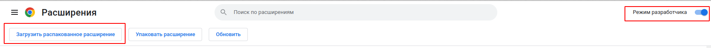

# Расширение для google chrome которое позволяет смотреть видео на ютубе в режиме - картинка в картинке

### Установка
```
wget https://github.com/ivankoTut/YouTubePictueInPictureChromeExt/archive/refs/heads/master.zip 
unzip master.zip
```
или скачать по ссылке архив и разархивируй его

перейти по ссылке

[chrome://extensions/](chrome://extensions/)

включить режим разработки и загрузить распакованное расширение
